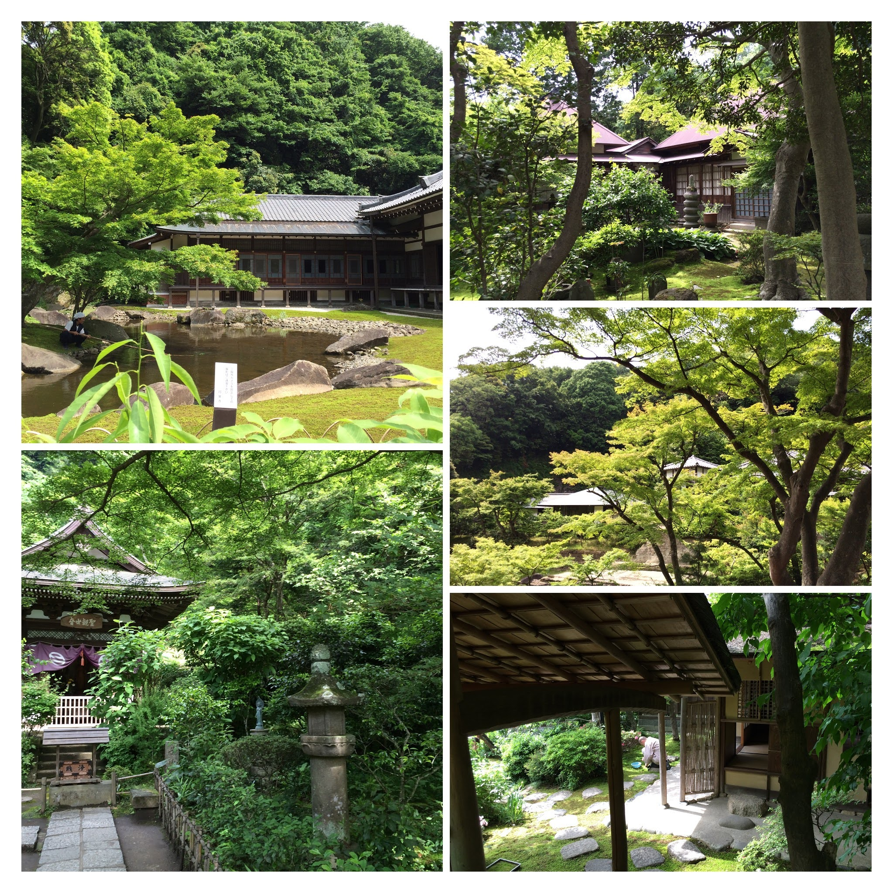
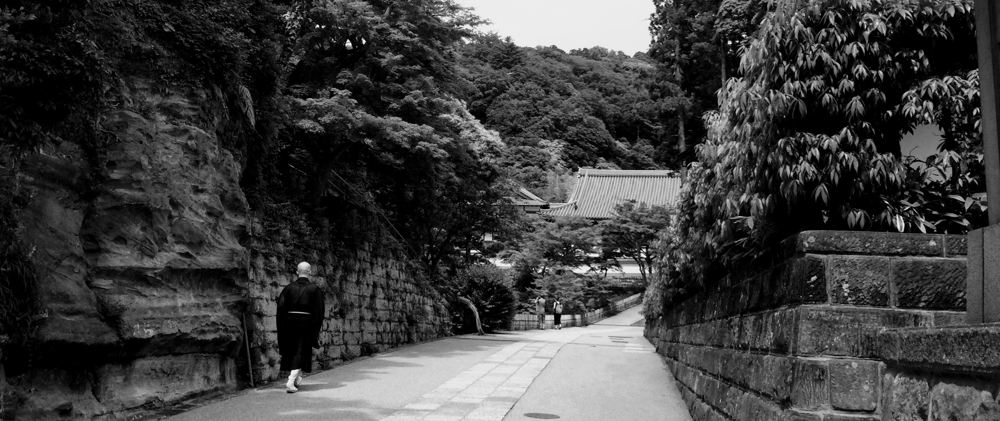
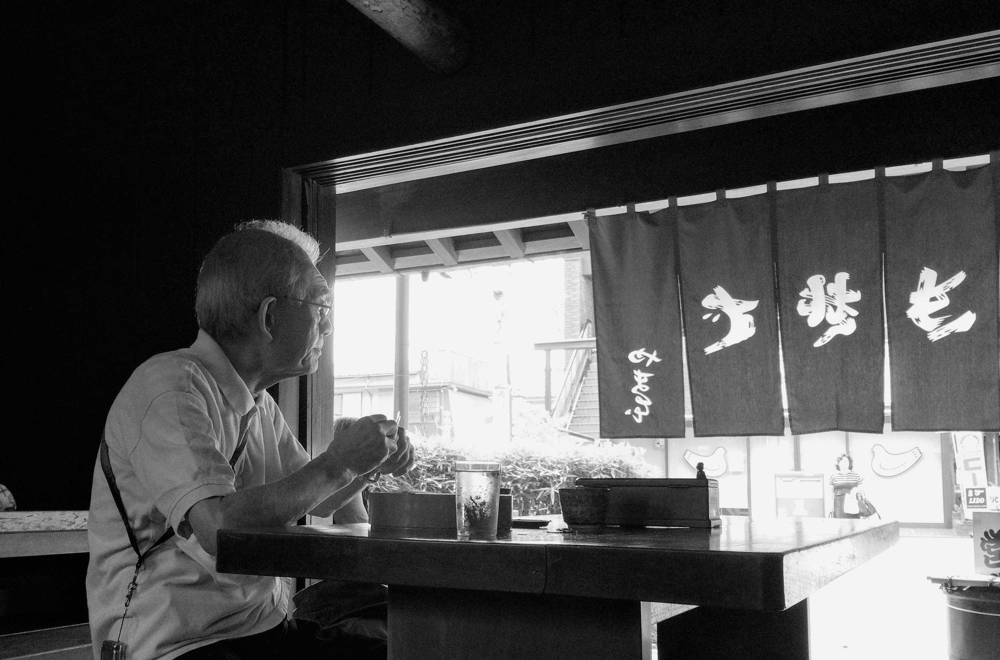

```{r setup, include=FALSE}
knitr::opts_chunk$set(echo = FALSE)

# Learn more about creating blogs with Distill at:
# https://rstudio.github.io/distill/blog.html

```
Of all the cities visited in Japan, most memorable is 鎌倉市 (Kamakura City).  
Located about an hour south of Tokyo Station.



Its combination of temples and shrines that rival any larger destinations.

In addition, Kamakura and Kita Kamakura (Yamanouchi) has almost a perfect layout of the land and sea.

Close proximity of ocean to the land and mountains nearby.
And how man made buildings co-exist with nature.

It is also hard to distinguish new from the old.  
Where nature starts and man-made boundaries end.

The spirit of old Kamakura Period pervades the town.



### Reflections at a Restaurant

Saw a gentleman in a reflective mood.

At that time, thought to myself, he looks very old.
(not many years later, I am approaching his age)

- Perhaps he was recalling earlier in life when he visited Kamakura with his young wife.
- Recalling a business venture that didn't go as planned.
- Thinking of an old friend that recently passed away.


[やま本きそば](https://goo.gl/maps/TB1fUnTbsUKsXaXo7)

There have been periods in my life, when I wished for time to slow down.  
Savor the stay at Asian countries that I always wished to visit.

In equal measure, there have been times, especially some nights, seemingly will not end.

Mercifully all these times have passed and I have grown from those experiences.

- What lessons do I recall from earlier generations?
- What memories will future generations have of us?
